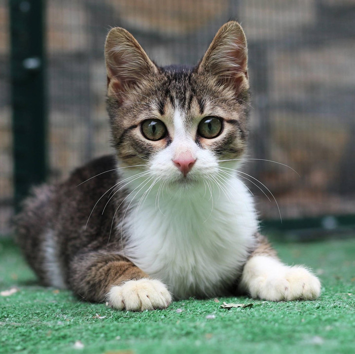

# Araclip

## How to use 
```
pip install git+https://github.com/Arabic-Clip/Araclip.git
```
```python
from araclip import AraClip
model = AraClip.from_pretrained("Arabic-Clip/araclip")
```

```python
labels = ["قطة جالسة", "قطة تقفز" ,"كلب", "حصان"]
image = Image.open("cat.png")

image_features = araclip.embed(image=image)
text_features = np.stack([araclip.embed(text=label) for label in labels])

similarities = text_features @ image_features
best_match = labels[np.argmax(similarities)]

print(f"The image is most similar to: {best_match}")
# قطة جالسة
```

